# SMS Spam Classification using Deep Learning and NLP

### Berkeley D. Willis

## Introduction

Spam classification is a problem that filters and Data Science has been combating for ages at this point. From basic "Prince of Nigeria" or "You Won the Lottery" emails, it has been a long battle and with Data Science the filters have only gotten better. Today these have escalated even further with creation of Spam using SMS messages, which are commonly just seens a text messages on our phones today. This kinda creates another difficult hurdle to fight spam because of the very human urge to immediately look at and handle text messages on our cell phones. This type of urge is one of the reasons why that emails, which many people will tkae longer to get to and respond to, aren't necessarily as successful now. Literall just the other day I got a text message from an email account that was linked to some domain that was borderline illegible or I think maybe from some random gmail account, saying to click on some link to get my Fedex package resent since it missed my last delivery. And this kind of langauge is to make us want to act more rapaciously, which just again compounds on the nature of text messages, and add in that delivery companies and others will actually message us on our phones about packages. 

This has made our position more and more complicated, as the spam is still overlynumerous, companies are getting more of our immediate attention using these ways of communication through automation, and people just get more immpatient with very short attention spans. With these challenges it is imperative to create effective models that can identify spam from valid messages, and with recent research using Deep Learning and NLP might create more effective models. 


## Exploratory Data Analysis

First going to load and explore the data a bit to figure out how much it may need to be sanitized and what datapoints might be relevant for this.


```python
# Going to store all loaded libraries up here first of course
import re
import pandas as pd
from pandarallel import pandarallel
import numpy as np
import seaborn as sns
import matplotlib.pyplot as plt
from pathlib import Path
import nltk
from wordcloud import WordCloud, STOPWORDS, ImageColorGenerator
from nltk.corpus import stopwords
from nltk.stem.porter import PorterStemmer
from nltk.stem import WordNetLemmatizer
from sklearn.model_selection import train_test_split

# Deep learning tensorflow module
import tensorflow as tf
from tensorflow.keras.preprocessing.text import Tokenizer
from tensorflow.keras.preprocessing.sequence import pad_sequences
from tensorflow.keras.callbacks import EarlyStopping
from tensorflow.keras.models import Sequential
from tensorflow.keras.layers import Embedding, GlobalAveragePooling1D, Dense, Dropout, LSTM, Bidirectional

# Translation library
from gingerit.gingerit import GingerIt

# I used this specifically to let me know progress from GingerIT was being made
pandarallel.initialize(progress_bar=True)

%matplotlib inline
```

    INFO: Pandarallel will run on 8 workers.
    INFO: Pandarallel will use Memory file system to transfer data between the main process and workers.


```python
# Setup data dir, read the file in, and see a quick and small sample
sms_data = Path("./data/spam.csv").resolve()
sms_data_df = pd.read_csv(sms_data)
display(sms_data_df.describe())
```


<div>
<style scoped>
    .dataframe tbody tr th:only-of-type {
        vertical-align: middle;
    }

    .dataframe tbody tr th {
        vertical-align: top;
    }

    .dataframe thead th {
        text-align: right;
    }
</style>
<table border="1" class="dataframe">
  <thead>
    <tr style="text-align: right;">
      <th></th>
      <th>v1</th>
      <th>v2</th>
      <th>Unnamed: 2</th>
      <th>Unnamed: 3</th>
      <th>Unnamed: 4</th>
    </tr>
  </thead>
  <tbody>
    <tr>
      <th>count</th>
      <td>5572</td>
      <td>5572</td>
      <td>50</td>
      <td>12</td>
      <td>6</td>
    </tr>
    <tr>
      <th>unique</th>
      <td>2</td>
      <td>5169</td>
      <td>43</td>
      <td>10</td>
      <td>5</td>
    </tr>
    <tr>
      <th>top</th>
      <td>ham</td>
      <td>Sorry, I'll call later</td>
      <td>bt not his girlfrnd... G o o d n i g h t . . .@"</td>
      <td>MK17 92H. 450Ppw 16"</td>
      <td>GNT:-)"</td>
    </tr>
    <tr>
      <th>freq</th>
      <td>4825</td>
      <td>30</td>
      <td>3</td>
      <td>2</td>
      <td>2</td>
    </tr>
  </tbody>
</table>
</div>


This is somewhat interesting, is that there is multiple messages. What it seems to be is a part of the "conversation" or responses to the initial messages. Some of it makes sense, but some of it is just unreadable, one instance could be because it maybe a password but I can't be sure. 

Actually the way it might be is multiple messages from the same entity but were back to back with no response for a user. 

This makes me want to join all of them together and then join them together. But to do this without accidentally inserting a bunch of NaNs at the end of a message, going to have to first clean them by setting NaNs to empty strings. 

After that I want to see what common words are used in both of these set of data, both spam and non-spam (ham). 


```python
# Gotta do some basic cleaning first
sms_data_df['is_spam'] = 0
sms_data_df.loc[(sms_data_df['v1']=="spam"), 'is_spam'] = 1

for col in ["Unnamed: 2", "Unnamed: 3", "Unnamed: 4"]:
    sms_data_df[col].fillna("",inplace=True)

# Now putting them together to a single field for the tokenization, wordclouds, and the models
sms_data_df['full_message'] = sms_data_df['v2'] + sms_data_df['Unnamed: 2'] \
    + sms_data_df['Unnamed: 3'] + sms_data_df['Unnamed: 4']

sms_data_df.head()
```


<div>
<style scoped>
    .dataframe tbody tr th:only-of-type {
        vertical-align: middle;
    }

    .dataframe tbody tr th {
        vertical-align: top;
    }

    .dataframe thead th {
        text-align: right;
    }
</style>
<table border="1" class="dataframe">
  <thead>
    <tr style="text-align: right;">
      <th></th>
      <th>v1</th>
      <th>v2</th>
      <th>Unnamed: 2</th>
      <th>Unnamed: 3</th>
      <th>Unnamed: 4</th>
      <th>is_spam</th>
      <th>full_message</th>
    </tr>
  </thead>
  <tbody>
    <tr>
      <th>0</th>
      <td>ham</td>
      <td>Go until jurong point, crazy.. Available only ...</td>
      <td></td>
      <td></td>
      <td></td>
      <td>0</td>
      <td>Go until jurong point, crazy.. Available only ...</td>
    </tr>
    <tr>
      <th>1</th>
      <td>ham</td>
      <td>Ok lar... Joking wif u oni...</td>
      <td></td>
      <td></td>
      <td></td>
      <td>0</td>
      <td>Ok lar... Joking wif u oni...</td>
    </tr>
    <tr>
      <th>2</th>
      <td>spam</td>
      <td>Free entry in 2 a wkly comp to win FA Cup fina...</td>
      <td></td>
      <td></td>
      <td></td>
      <td>1</td>
      <td>Free entry in 2 a wkly comp to win FA Cup fina...</td>
    </tr>
    <tr>
      <th>3</th>
      <td>ham</td>
      <td>U dun say so early hor... U c already then say...</td>
      <td></td>
      <td></td>
      <td></td>
      <td>0</td>
      <td>U dun say so early hor... U c already then say...</td>
    </tr>
    <tr>
      <th>4</th>
      <td>ham</td>
      <td>Nah I don't think he goes to usf, he lives aro...</td>
      <td></td>
      <td></td>
      <td></td>
      <td>0</td>
      <td>Nah I don't think he goes to usf, he lives aro...</td>
    </tr>
  </tbody>
</table>
</div>


```python
# Now to create the world clouds for both spam and non-spam
real_msg_cloud = WordCloud(stopwords=STOPWORDS, background_color='white', collocations=False)\
    .generate(' '.join(sms_data_df[sms_data_df.is_spam==0]['full_message'].to_list()))

spam_msg_cloud = WordCloud(stopwords=STOPWORDS, background_color='white', collocations=False)\
    .generate(' '.join(sms_data_df[sms_data_df.is_spam==1]['full_message'].to_list()))

# Now putting them in the same figures
f = plt.figure(figsize=(20,6))
ax = f.add_subplot(1,2,1)
ax.set_title('WordCloud of Real Messages')
ax.imshow(real_msg_cloud)
plt.axis('off')
ax = f.add_subplot(1,2,2)
ax.set_title('WordCloud of Spam Messages')
ax.imshow(spam_msg_cloud)
plt.axis('off')
```


    (-0.5, 399.5, 199.5, -0.5)


    
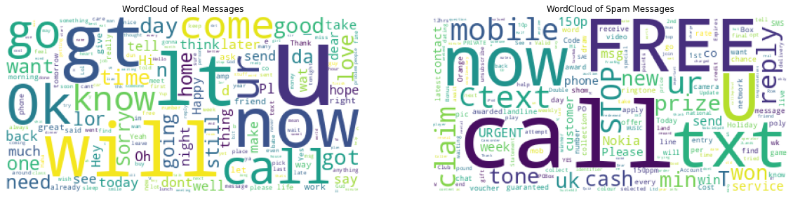
    


Well the WordClouds that were generated did seem to have some interesting results, though the Real messages don't really seem to be nearly as interesting. 

The real messages words do seem to just be mixed and not really revealing a pattern beyond a few actions words, asking for a call, u, and now. 

However, the Spam messages WordCloud the though do seem to have more words we might commonly relate to a spam or scam message. Words that are really attaention grabbing and asking for immediate response and attention, like STOP, call, now FREE, cash, reply, text, prize, won, and URGENT littered throughout. 

I am curious about a couple of other data points though, like length and distrobutions of the messages.


```python
real_msg_lens = sms_data_df[sms_data_df.is_spam==0]['full_message'].str.len()
spam_msg_lens = sms_data_df[sms_data_df.is_spam==1]['full_message'].str.len()

# lens_df = pd.DataFrame({'length':real_msg_lens, 'class':'Real'})
lens_df = pd.concat([pd.DataFrame({'length':real_msg_lens, 'class':'Real'}), 
                   pd.DataFrame({'length':spam_msg_lens, 'class':'Spam'})])

sns.kdeplot(data=lens_df, x="length", hue="class").set_title("Length Distrobutions of Messages")
```


    Text(0.5, 1.0, 'Length Distrobutions of Messages')


    
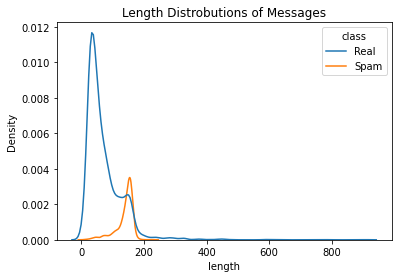
    


The interesting thing here is that there does seem to some pattern for many of the spam messages, they seem to be consistently longer. The largest parts of the density distroubtions of real messages are rather low, and do have many that are around the same length of spam. However, if you looks at only spam lengths in the context of the rest, there is a very large collection of just under 200. This may indicate that the longer the message up to about 200 characters, the more likely are to be spam.

Now to help do some of these operations that might need to be done over and voer again, some helper functions are going to be created. 


```python
# First a way to split the data, I want to experiement which is better to either to go lower case or not
# But one way or another we need to clean out all of the non junk characters that won't tokenize well
def clean_messages(text, expand=False, remove_stop=False, lemmatize=False):
    # Just setting a singular reference that can be reused here
    clean_text = text.lower()
    # If we are expanding, should do it here using GingerIT
    if expand:
        parser = GingerIt()
        # It was throwing errors for the "corrections" key that is applied but it's probably an API limitation
        # Either way have to surround it with try catch loop
        try:
            clean_text = parser.parse(clean_text)['result']
        except KeyError:
            pass
    
    # Now doing some basic cleaning operations for non-alpha chars, this is the min cleaning
    clean_text = re.sub('[^a-zA-Z]', ' ', clean_text)
    clean_text = clean_text.split()
    # Removing stopwords if we need to
    if remove_stop:
        # Going to remove stop words
        stop_words = set(stopwords.words("english"))
        clean_text = [word for word in clean_text if word not in stop_words]
    
    if lemmatize:
        lemmatizer = WordNetLemmatizer()
        clean_text = [lemmatizer.lemmatize(word, pos ='v') for word in clean_text]

    # Now to return the text
    return(re.sub('\s+', ' ', ' '.join(clean_text)).strip())


# Now a function to tokenize and shuffle the data, this way I don't have to worry about doing it multiple times
def split_tokenize(p_df, text_col, vocab_size=100, seq_len=50, meta_data=False):
    # Running the split
    train_msg, test_msg, train_lens, test_lens, train_labels, test_labels = train_test_split(
        p_df[text_col], p_df['full_message'], p_df['is_spam'], test_size=0.2, random_state=1234)
    # Calculating the lengths
    train_lens = train_lens.str.len().to_numpy()
    test_lens = test_lens.str.len().to_numpy()
    # Size of tokenzied vocab can differ, but will not consider single characters as a token
    # And requiring special characters for out of vocab token for words that aren't in the dict
    tokenizer = Tokenizer(num_words = vocab_size, char_level=False, oov_token = "<oov>")
    tokenizer.fit_on_texts(train_msg)
    word_index = tokenizer.word_index
    # Now to sequence the data and pad it out
    train_sequences = tokenizer.texts_to_sequences(train_msg)
    train_padded = pad_sequences(train_sequences, maxlen=seq_len, 
                                    padding="post", truncating="post")
    test_sequences = tokenizer.texts_to_sequences(test_msg)
    test_padded = pad_sequences(test_sequences, maxlen=seq_len, 
                                    padding="post", truncating="post")
    if meta_data:
        # Going to attach length metadata for each message, can filter out the column in models if needed
        train_padded = np.column_stack((train_lens, train_padded))
        test_padded = np.column_stack((test_lens, test_padded))
    # Finallyl returning them
    return (train_padded, test_padded, train_labels, test_labels)

# A function to go ahead, take the history data and then visualize it in matplotlib
def visualize_history(history_obj, title, var1_name, var2_name, metric_name):
    plt.plot(history_obj.history[var1_name], label=var1_name)
    plt.plot(history_obj.history[var2_name], label=var2_name)
    plt.title(title)
    plt.xlabel("Number of epochs")
    plt.ylabel(metric_name)
    plt.legend([var1_name, var2_name])
    plt.show()

# Finally a function to take the results of an evaluation of the test data to other results
def attach_results(model_name, eval_results, results_df=None):
    ret_df = pd.DataFrame(data={'model_name':model_name, 'model_loss':eval_results[0],
                          'model_accuracy':eval_results[1]}, index=[0])
    # Return if we don't have anything to concat
    if results_df is None:
        return ret_df
    # Otherwise run concat and return new results
    return pd.concat([results_df, ret_df], ignore_index=True)
    

# Going to go ahead and set some common variables that will be used for model building and some parallelization
num_epochs = 30
drop_rate = 0.2
early_stop = EarlyStopping(monitor='val_loss', patience=3)

```

The functions that I have drafted above are based on what I have read about doing Spam classifiers, some NTLK tips have gotten from a coleague of mine, and some basic cleaning that I knew was going to have to happen in order to make the tokenization dictionary as effective/broad as possible. With these in place  Ican clean the data, see how much it may have changed, prune and then tokenize before creating the models I want to test.

I am going to run and create multiple versions of the full messages that will be used to test the various different ways that the data was cleaned and NLP operations that are run on them.

These operations were parllelized because GingerIT was taking a while and  Icouldn't see the progress that it was making. Thus I decided to parallelize it, but it still runs a bit slow (beware) because it is contacting an API from the GingerIT library. Either way it's been parallelized in hopes to get better runtimes, and at least I can see the progress that is being made on the operations. 

I also am curious how the WordClouds would change from all the different cleaning and NLP operations to simplifiy the text changes them. 


```python
# Going to apply the cleaning for every messsage, and regen he WordClouds to see if anything major changed
# sms_data_df['clean_message_basic'] = sms_data_df['full_message'].parallel_apply(clean_messages)
sms_data_df['clean_message_basic'] = sms_data_df['full_message'].parallel_apply(clean_messages, args=(
                                                                                False, False, False))
sms_data_df['clean_message_stopwords'] = sms_data_df['full_message'].parallel_apply(clean_messages, args=(
                                                                                False, True, False))
sms_data_df['clean_message_lem'] = sms_data_df['full_message'].parallel_apply(clean_messages, args=(
                                                                                False, True, True))
sms_data_df['clean_message_final'] = sms_data_df['full_message'].parallel_apply(clean_messages, args=(
                                                                                True, True, True))

# See if the cleaning and lemminzation changed the clouds

new_wc_stopwords = STOPWORDS.union(set(list('abcdefghijklmnopqrstuvwxyz')))
real_msg_cloud = WordCloud(stopwords=new_wc_stopwords, background_color='white', collocations=False)\
    .generate(' '.join(sms_data_df[sms_data_df.is_spam==0]['clean_message_final'].to_list()))

spam_msg_cloud = WordCloud(stopwords=new_wc_stopwords, background_color='white', collocations=False)\
    .generate(' '.join(sms_data_df[sms_data_df.is_spam==1]['clean_message_final'].to_list()))

# Now putting them in the same figures
f = plt.figure(figsize=(20,6))
ax = f.add_subplot(1,2,1)
ax.set_title('WordCloud of Real Messages')
ax.imshow(real_msg_cloud)
plt.axis('off')
ax = f.add_subplot(1,2,2)
ax.set_title('WordCloud of Spam Messages')
ax.imshow(spam_msg_cloud)
plt.axis('off')
```


    VBox(children=(HBox(children=(IntProgress(value=0, description='0.00%', max=697), Label(value='0 / 697'))), HB…


    VBox(children=(HBox(children=(IntProgress(value=0, description='0.00%', max=697), Label(value='0 / 697'))), HB…


    VBox(children=(HBox(children=(IntProgress(value=0, description='0.00%', max=697), Label(value='0 / 697'))), HB…


    VBox(children=(HBox(children=(IntProgress(value=0, description='0.00%', max=697), Label(value='0 / 697'))), HB…


    (-0.5, 399.5, 199.5, -0.5)


    
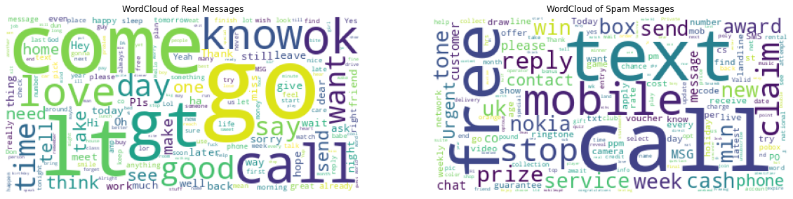
    


The primary reason why I also modded the stop words for the collection of singular words is because I want to try to remove all singular characters to end up in the tokenizer because those will likely be some of the most repetative words and could mess with the model. 

There could be an issue with the model as well with sampling since there is an obvious imbalance of spam vs non-spam messages. I am going to be creating the first models anyways to see if it is a real problem though before trying to fix it, if it turns out not to be an issue for the model becmoning bias then no fix is necessary. 

Going to run the tokenizers and get a quick glimpse of what the data looks like afterwards, particularly to make sure the seed is set for a decent enough distrobution of classes of messages.

### Deep Learning with sequences and metadata

For this round of training and testing, I want to see what the results look like how effective using the metadata would be. Typically some of these methods using Embedding and LSTMs are very sequentially based, but going to try it here and see what the overall effect is. 


```python
train_padded, test_padded, train_labels, test_labels = split_tokenize(
    sms_data_df, "clean_message_basic", 750, 200, True)

max_vocab = max(train_padded[:,0:1])[0] + 1

print("Shape data - training data={}:testing_data={}".format(train_padded.shape, test_padded.shape))
print("Distribution of spam - training={},:testing{}".format(sum(train_labels),sum(test_labels)))
print("Maximum value for Embedding attirbutes: {}".format(max_vocab))
```

    Shape data - training data=(4457, 201):testing_data=(1115, 201)
    Distribution of spam - training=575,:testing172
    Maximum value for Embedding attirbutes: 911


The distribution of the data is alright, now to build a deep learning model in order to test classification.


```python
# First going to make a normal dense model

# Setting up model
dense_model = Sequential()
dense_model.add(Embedding(max_vocab, 16, input_length=201))
dense_model.add(GlobalAveragePooling1D())
dense_model.add(Dense(24, activation='relu'))
dense_model.add(Dropout(drop_rate))
dense_model.add(Dense(1, activation='sigmoid'))

# Now compiling the model
dense_model.compile(loss='binary_crossentropy',optimizer='adam' ,metrics=['accuracy'])

# Now fitting models and getting history for visualization
history1 = dense_model.fit(train_padded, train_labels, epochs=num_epochs, 
                    validation_data=(test_padded, test_labels),callbacks =[early_stop],verbose=0)
visualize_history(history1, "Dense Model: Training and Validation Accuracy", 
                  "accuracy", "val_accuracy", "Accuracy")
visualize_history(history1, "Dense Model: Training and Validation Loss", 
                  "loss", "val_loss", "Loss")

# Evaluating the model
m_eval1 = dense_model.evaluate(test_padded, test_labels, verbose=0)
full_results_df = attach_results("Embeding Dense Model Using Basic Cleaning w/metadata", m_eval1)
print("Testing Dense model: loss={},accuracy={}".format(m_eval1[0], m_eval1[1]))


# Now creating a LSTM bi-directional model

# Against setting up model
ltsm_model = Sequential()
ltsm_model.add(Embedding(max_vocab, 16, input_length=201))
ltsm_model.add(Bidirectional(LSTM(20, dropout=drop_rate, return_sequences=True)))
ltsm_model.add(Dense(1, activation='sigmoid'))

# Compile and fit the model
ltsm_model.compile(loss = 'binary_crossentropy', optimizer = 'adam', metrics=['accuracy'])
history2 = ltsm_model.fit(train_padded, train_labels, epochs=num_epochs, 
                    validation_data=(test_padded, test_labels),callbacks =[early_stop], verbose=0)
visualize_history(history2, "Bi-directional LTSM Model: Training and Validation accuracy", 
                  "accuracy", "val_accuracy", "Accuracy")
visualize_history(history2, "Bi-directional LTSM Model: Training and Validation Accuracy", 
                  "loss", "val_loss", "Loss")

m_eval2 = ltsm_model.evaluate(test_padded, test_labels, verbose=0)
full_results_df = attach_results("Bi-LSTM Model Using Basic Cleaning w/metadata", m_eval2, full_results_df)
print("Testing LTSM model: loss={},accuracy={}".format(m_eval2[0], m_eval2[1]))

```


    
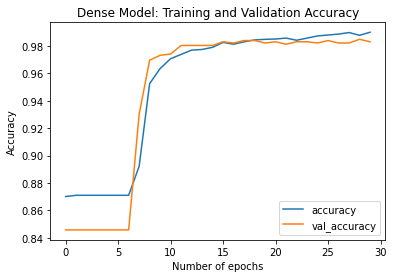
    


    
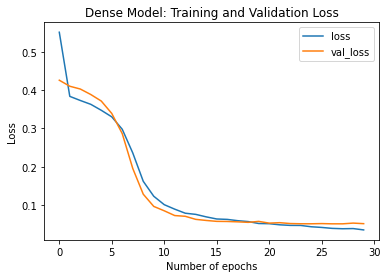
    


    Testing Dense model: loss=0.05096888542175293,accuracy=0.9829596281051636


    
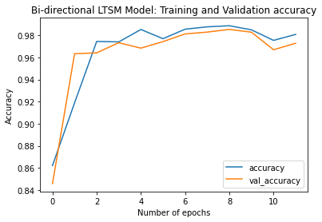
    


    
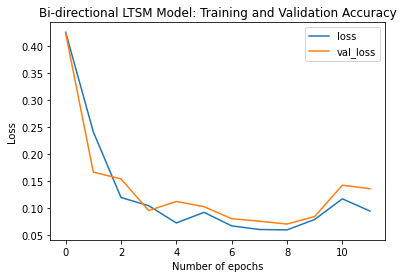
    


    Testing LTSM model: loss=0.13563814759254456,accuracy=0.9727907180786133


```python
# First going to make a normal dense model

# Setting up model
dense_model = Sequential()
dense_model.add(Embedding(750, 16, input_length=200))
dense_model.add(GlobalAveragePooling1D())
dense_model.add(Dense(24, activation='relu'))
dense_model.add(Dropout(drop_rate))
dense_model.add(Dense(1, activation='sigmoid'))

# Now compiling the model
dense_model.compile(loss='binary_crossentropy',optimizer='adam' ,metrics=['accuracy'])

# Now fitting models and getting history for visualization
history1 = dense_model.fit(train_padded[:,1:], train_labels, epochs=num_epochs, 
                    validation_data=(test_padded[:,1:], test_labels),callbacks =[early_stop],verbose=0)
visualize_history(history1, "Dense Model: Training and Validation Accuracy", 
                  "accuracy", "val_accuracy", "Accuracy")
visualize_history(history1, "Dense Model: Training and Validation Loss", 
                  "loss", "val_loss", "Loss")

# Evaluating the model
m_eval1 = dense_model.evaluate(test_padded[:,1:], test_labels, verbose=0)
full_results_df = attach_results("Embeding Dense Model Using Basic Cleaning wo/metadata", m_eval1, full_results_df)
print("Testing Dense model: loss={},accuracy={}".format(m_eval1[0], m_eval1[1]))


# Now creating a LSTM bi-directional model

# Against setting up model
ltsm_model = Sequential()
ltsm_model.add(Embedding(750, 16, input_length=200))
ltsm_model.add(Bidirectional(LSTM(20, dropout=drop_rate, return_sequences=True)))
ltsm_model.add(Dense(1, activation='sigmoid'))

# Compile and fit the model
ltsm_model.compile(loss = 'binary_crossentropy', optimizer = 'adam', metrics=['accuracy'])
history2 = ltsm_model.fit(train_padded[:,1:], train_labels, epochs=num_epochs, 
                    validation_data=(test_padded[:,1:], test_labels),callbacks =[early_stop], verbose=0)
visualize_history(history2, "Bi-directional LTSM Model: Training and Validation accuracy", 
                  "accuracy", "val_accuracy", "Accuracy")
visualize_history(history2, "Bi-directional LTSM Model: Training and Validation Accuracy", 
                  "loss", "val_loss", "Loss")

m_eval2 = ltsm_model.evaluate(test_padded[:,1:], test_labels, verbose=0)
full_results_df = attach_results("Bi-LSTM Model Using Basic Cleaning wo/metadata", m_eval2, full_results_df)
print("Testing LTSM model: loss={},accuracy={}".format(m_eval2[0], m_eval2[1]))

```


    
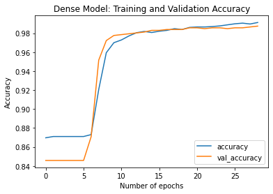
    


    
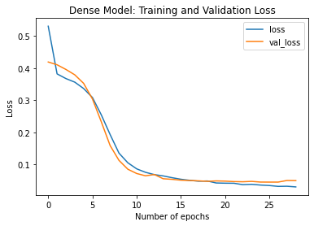
    


    Testing Dense model: loss=0.050163935869932175,accuracy=0.9874439239501953


    
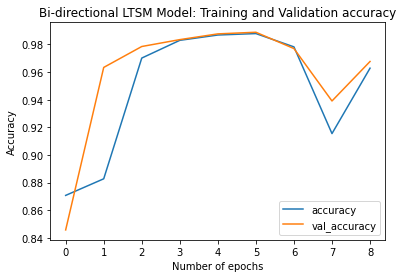
    


    
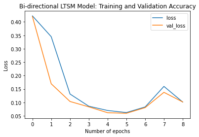
    


    Testing LTSM model: loss=0.10160316526889801,accuracy=0.9676951766014099


```python
display(full_results_df)
```


<div>
<style scoped>
    .dataframe tbody tr th:only-of-type {
        vertical-align: middle;
    }

    .dataframe tbody tr th {
        vertical-align: top;
    }

    .dataframe thead th {
        text-align: right;
    }
</style>
<table border="1" class="dataframe">
  <thead>
    <tr style="text-align: right;">
      <th></th>
      <th>model_name</th>
      <th>model_loss</th>
      <th>model_accuracy</th>
    </tr>
  </thead>
  <tbody>
    <tr>
      <th>0</th>
      <td>Embeding Dense Model Using Basic Cleaning w/me...</td>
      <td>0.050969</td>
      <td>0.982960</td>
    </tr>
    <tr>
      <th>1</th>
      <td>Bi-LSTM Model Using Basic Cleaning w/metadata</td>
      <td>0.135638</td>
      <td>0.972791</td>
    </tr>
    <tr>
      <th>2</th>
      <td>Embeding Dense Model Using Basic Cleaning wo/m...</td>
      <td>0.050164</td>
      <td>0.987444</td>
    </tr>
    <tr>
      <th>3</th>
      <td>Bi-LSTM Model Using Basic Cleaning wo/metadata</td>
      <td>0.101603</td>
      <td>0.967695</td>
    </tr>
  </tbody>
</table>
</div>


It seems that both fo these types of models were quite accurate in the end, with both around 98%. Any type of improvements that are going to be so small it might be difficult to see whether or not there was an actual difference. This is also the situation that we have here, where the difference in either direction is so small that it's possibly in some margin of error with tenths of a percent or just had bad "luck" for the ranodmization of certain starting points/adjustments.

### Testing w/o Metadata for Multiple NLP and Cleaning Strategies

Now that there is a basic flow of how these models will be build and run throughout each. They are still around 98%, and for each new model added they will have different tokeniers created by different set of operations. The reason why a bi-directional LTSM was chosen is because it can help be more contextually aware of words by having both forwards and "backwards" for the calculation for some classification. I thought I might perhaps help here, but it seems that it was less effective that I had hoped in this case. Something interesting here is that the early stop condition was triggered before it could even get through each epoch, you can tell in this case by taking a look at the X axis, and this is also seen by the validation loss function results and validation accuracy dips. 

However, it doesn't seem that downsizing here is necessary so that will not be done since we are already in the 98% accuracy range. 

Couple of different observations and things I think that might be somewhat causing this, which may make me try one more NLP trick, and that is the amount of data that is being lost because of short hand in text messages. For exacmples you is shortened to "u" which gets filtered out, 'ur' translates to either "your" or "you're" and weekly gets shortened to "wkly." This kinda both expands the tokenization and vectorization, and also casues some issues with having it in multiple times or even completely filtered out. There are possibly some ways that it can be fixed, if it could be reliably translated back to normal english text instead of short hand. 

Now a quick not before I try this out, I am really satisfied with the other results and there is some possibly reliability issues with this since this can very easily be a many-many relationship between words and their short hand because context really matters a lot. If anything we are eigher going to hurt the accuracy of the existing models or possibly just get better returns but dimished because the models are already highly effective. 

The library that is going to be used here is call 'gingerit' which from some tests I've seen is best at this type of translation, but not always accurate just because it's extremly difficult problem with tons of nuance. 

The results of each one will be seen here, but I am going to show the entire set of run results at the end.

All other splits as well will now not include the metadata and not require any type of scoping in order to get fitted in the new model sizing.


```python
train_padded, test_padded, train_labels, test_labels = split_tokenize(
    sms_data_df, "clean_message_stopwords", 750, 200)

max_vocab = max(train_padded[:,0:1])[0] + 1

print("Shape data - training data={}:testing_data={}".format(train_padded.shape, test_padded.shape))
print("Distribution of spam - training={},:testing{}".format(sum(train_labels),sum(test_labels)))
print("Maximum value for Embedding attirbutes: {}".format(max_vocab))
```

    Shape data - training data=(4457, 200):testing_data=(1115, 200)
    Distribution of spam - training=575,:testing172
    Maximum value for Embedding attirbutes: 749


Now we are going to re-run the same models without the metadata since it performed better via these models. This time we are going to be using the dataset that had stopwords removed from the tokenization process. 


```python
# Same code for each of these just using different sets of data with differing NLP models

# Setting up model
dense_model = Sequential()
dense_model.add(Embedding(750, 16, input_length=200))
dense_model.add(GlobalAveragePooling1D())
dense_model.add(Dense(24, activation='relu'))
dense_model.add(Dropout(drop_rate))
dense_model.add(Dense(1, activation='sigmoid'))

# Now compiling the model
dense_model.compile(loss='binary_crossentropy',optimizer='adam' ,metrics=['accuracy'])

# Now fitting models and getting history for visualization
history1 = dense_model.fit(train_padded, train_labels, epochs=num_epochs, 
                    validation_data=(test_padded, test_labels),callbacks =[early_stop],verbose=0)
visualize_history(history1, "Dense Model: Training and Validation Accuracy", 
                  "accuracy", "val_accuracy", "Accuracy")
visualize_history(history1, "Dense Model: Training and Validation Loss", 
                  "loss", "val_loss", "Loss")

# Evaluating the model
m_eval1 = dense_model.evaluate(test_padded, test_labels, verbose=0)
full_results_df = attach_results("Embeding Dense Model Using Cleaning With Stopwords", m_eval1, full_results_df)
print("Testing Dense model: loss={},accuracy={}".format(m_eval1[0], m_eval1[1]))


# Now creating a LSTM bi-directional model

# Against setting up model
ltsm_model = Sequential()
ltsm_model.add(Embedding(750, 16, input_length=200))
ltsm_model.add(Bidirectional(LSTM(20, dropout=drop_rate, return_sequences=True)))
ltsm_model.add(Dense(1, activation='sigmoid'))

# Compile and fit the model
ltsm_model.compile(loss = 'binary_crossentropy', optimizer = 'adam', metrics=['accuracy'])
history2 = ltsm_model.fit(train_padded, train_labels, epochs=num_epochs, 
                    validation_data=(test_padded, test_labels),callbacks =[early_stop], verbose=0)
visualize_history(history2, "Bi-directional LTSM Model: Training and Validation accuracy", 
                  "accuracy", "val_accuracy", "Accuracy")
visualize_history(history2, "Bi-directional LTSM Model: Training and Validation Accuracy", 
                  "loss", "val_loss", "Loss")

m_eval2 = ltsm_model.evaluate(test_padded, test_labels, verbose=0)
full_results_df = attach_results("Bi-LSTM Model Using Cleaning With Stopwords", m_eval2, full_results_df)
print("Testing LTSM model: loss={},accuracy={}".format(m_eval2[0], m_eval2[1]))

```


    
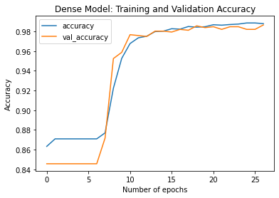
    


    
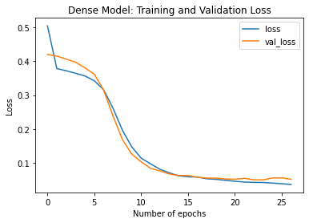
    


    Testing Dense model: loss=0.051686447113752365,accuracy=0.9865471124649048


    
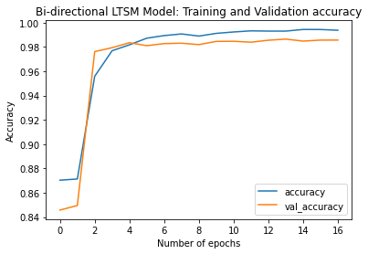
    


    
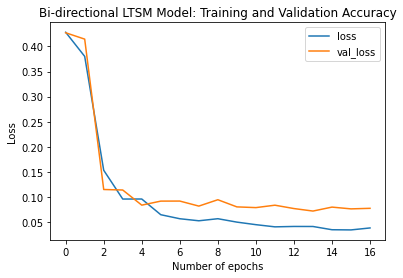
    


    Testing LTSM model: loss=0.0778166800737381,accuracy=0.9855918884277344


Same process of re-splitting the data and re-running the models using the data using replacment and all other process before this.


```python
train_padded, test_padded, train_labels, test_labels = split_tokenize(
    sms_data_df, "clean_message_lem", 750, 200)

max_vocab = max(train_padded[:,0:1])[0] + 1

print("Shape data - training data={}:testing_data={}".format(train_padded.shape, test_padded.shape))
print("Distribution of spam - training={},:testing{}".format(sum(train_labels),sum(test_labels)))
print("Maximum value for Embedding attirbutes: {}".format(max_vocab))

# Same code for each of these just using different sets of data with differing NLP models

# Setting up model
dense_model = Sequential()
dense_model.add(Embedding(750, 16, input_length=200))
dense_model.add(GlobalAveragePooling1D())
dense_model.add(Dense(24, activation='relu'))
dense_model.add(Dropout(drop_rate))
dense_model.add(Dense(1, activation='sigmoid'))

# Now compiling the model
dense_model.compile(loss='binary_crossentropy',optimizer='adam' ,metrics=['accuracy'])

# Now fitting models and getting history for visualization
history1 = dense_model.fit(train_padded, train_labels, epochs=num_epochs, 
                    validation_data=(test_padded, test_labels),callbacks =[early_stop],verbose=0)
visualize_history(history1, "Dense Model: Training and Validation Accuracy", 
                  "accuracy", "val_accuracy", "Accuracy")
visualize_history(history1, "Dense Model: Training and Validation Loss", 
                  "loss", "val_loss", "Loss")

# Evaluating the model
m_eval1 = dense_model.evaluate(test_padded, test_labels, verbose=0)
full_results_df = attach_results(
    "Embeding Dense Model Using Cleaning With Lemmatization", m_eval1, full_results_df)
print("Testing Dense model: loss={},accuracy={}".format(m_eval1[0], m_eval1[1]))


# Now creating a LSTM bi-directional model

# Against setting up model
ltsm_model = Sequential()
ltsm_model.add(Embedding(750, 16, input_length=200))
ltsm_model.add(Bidirectional(LSTM(20, dropout=drop_rate, return_sequences=True)))
ltsm_model.add(Dense(1, activation='sigmoid'))

# Compile and fit the model
ltsm_model.compile(loss = 'binary_crossentropy', optimizer = 'adam', metrics=['accuracy'])
history2 = ltsm_model.fit(train_padded, train_labels, epochs=num_epochs, 
                    validation_data=(test_padded, test_labels),callbacks =[early_stop], verbose=0)
visualize_history(history2, "Bi-directional LTSM Model: Training and Validation accuracy", 
                  "accuracy", "val_accuracy", "Accuracy")
visualize_history(history2, "Bi-directional LTSM Model: Training and Validation Accuracy", 
                  "loss", "val_loss", "Loss")

m_eval2 = ltsm_model.evaluate(test_padded, test_labels, verbose=0)
full_results_df = attach_results(
    "Bi-LSTM Model Using Cleaning With Lemmatization", m_eval2, full_results_df)
print("Testing LTSM model: loss={},accuracy={}".format(m_eval2[0], m_eval2[1]))

```

    Shape data - training data=(4457, 200):testing_data=(1115, 200)
    Distribution of spam - training=575,:testing172
    Maximum value for Embedding attirbutes: 750


    
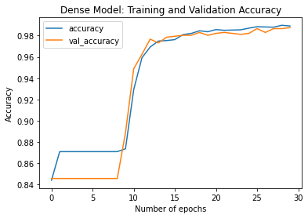
    


    
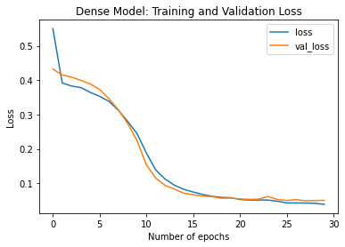
    


    Testing Dense model: loss=0.05012539029121399,accuracy=0.9874439239501953


    
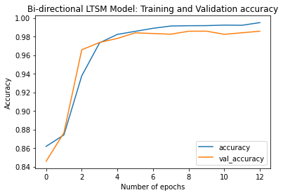
    


    
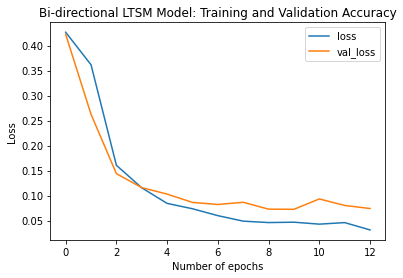
    


    Testing LTSM model: loss=0.07423023879528046,accuracy=0.9857801795005798


Finally going to run the split and create the models that utilize all that has been used before in order to see that the combination of all of these makes the quality of the models better.


```python
train_padded, test_padded, train_labels, test_labels = split_tokenize(
    sms_data_df, "clean_message_final", 750, 200)

max_vocab = max(train_padded[:,0:1])[0] + 1

print("Shape data - training data={}:testing_data={}".format(train_padded.shape, test_padded.shape))
print("Distribution of spam - training={},:testing{}".format(sum(train_labels),sum(test_labels)))
print("Maximum value for Embedding attirbutes: {}".format(max_vocab))

# Same code for each of these just using different sets of data with differing NLP models

# Setting up model
dense_model = Sequential()
dense_model.add(Embedding(750, 16, input_length=200))
dense_model.add(GlobalAveragePooling1D())
dense_model.add(Dense(24, activation='relu'))
dense_model.add(Dropout(drop_rate))
dense_model.add(Dense(1, activation='sigmoid'))

# Now compiling the model
dense_model.compile(loss='binary_crossentropy',optimizer='adam' ,metrics=['accuracy'])

# Now fitting models and getting history for visualization
history1 = dense_model.fit(train_padded, train_labels, epochs=num_epochs, 
                    validation_data=(test_padded, test_labels),callbacks =[early_stop],verbose=0)
visualize_history(history1, "Dense Model: Training and Validation Accuracy", 
                  "accuracy", "val_accuracy", "Accuracy")
visualize_history(history1, "Dense Model: Training and Validation Loss", 
                  "loss", "val_loss", "Loss")

# Evaluating the model
m_eval1 = dense_model.evaluate(test_padded, test_labels, verbose=0)
full_results_df = attach_results(
    "Embeding Dense Model Using Cleaning With All Cleaning", m_eval1, full_results_df)
print("Testing Dense model: loss={},accuracy={}".format(m_eval1[0], m_eval1[1]))


# Now creating a LSTM bi-directional model

# Against setting up model
ltsm_model = Sequential()
ltsm_model.add(Embedding(750, 16, input_length=200))
ltsm_model.add(Bidirectional(LSTM(20, dropout=drop_rate, return_sequences=True)))
ltsm_model.add(Dense(1, activation='sigmoid'))

# Compile and fit the model
ltsm_model.compile(loss = 'binary_crossentropy', optimizer = 'adam', metrics=['accuracy'])
history2 = ltsm_model.fit(train_padded, train_labels, epochs=num_epochs, 
                    validation_data=(test_padded, test_labels),callbacks =[early_stop], verbose=0)
visualize_history(history2, "Bi-directional LTSM Model: Training and Validation accuracy", 
                  "accuracy", "val_accuracy", "Accuracy")
visualize_history(history2, "Bi-directional LTSM Model: Training and Validation Accuracy", 
                  "loss", "val_loss", "Loss")

m_eval2 = ltsm_model.evaluate(test_padded, test_labels, verbose=0)
full_results_df = attach_results(
    "Bi-LSTM Model Using Cleaning With All Cleaning", m_eval2, full_results_df)
print("Testing LTSM model: loss={},accuracy={}".format(m_eval2[0], m_eval2[1]))

```

    Shape data - training data=(4457, 200):testing_data=(1115, 200)
    Distribution of spam - training=575,:testing172
    Maximum value for Embedding attirbutes: 749


    

    


    

    


    Testing Dense model: loss=0.049944519996643066,accuracy=0.9838564991950989


    
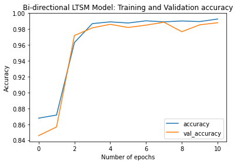
    


    

    


    Testing LTSM model: loss=0.06584947556257248,accuracy=0.9879998564720154


It did seem to have an improved the accuracy and really smoothed the graphs out when it comes to the training and validationd data. Something to note here is that these splits are the same as the previous one because of the seed that is set, but the models themselves have a small bit of randomization in changes of the weights. 

I think it was successful to slightly improve the accuracy of the models, but I would say that it can likely be improved further with larger pools of data for better samplinging and possibly a better way to translate the shorthand of text to full text that is able to be analyzed. If I had time I would possibly create a NLP model to help this type of translation, but GingerIT's parser si a very good tool to use for this type of testing. 


```python
display(full_results_df)
```


<div>
<style scoped>
    .dataframe tbody tr th:only-of-type {
        vertical-align: middle;
    }

    .dataframe tbody tr th {
        vertical-align: top;
    }

    .dataframe thead th {
        text-align: right;
    }
</style>
<table border="1" class="dataframe">
  <thead>
    <tr style="text-align: right;">
      <th></th>
      <th>model_name</th>
      <th>model_loss</th>
      <th>model_accuracy</th>
    </tr>
  </thead>
  <tbody>
    <tr>
      <th>0</th>
      <td>Embeding Dense Model Using Basic Cleaning w/me...</td>
      <td>0.050969</td>
      <td>0.982960</td>
    </tr>
    <tr>
      <th>1</th>
      <td>Bi-LSTM Model Using Basic Cleaning w/metadata</td>
      <td>0.135638</td>
      <td>0.972791</td>
    </tr>
    <tr>
      <th>2</th>
      <td>Embeding Dense Model Using Basic Cleaning wo/m...</td>
      <td>0.050164</td>
      <td>0.987444</td>
    </tr>
    <tr>
      <th>3</th>
      <td>Bi-LSTM Model Using Basic Cleaning wo/metadata</td>
      <td>0.101603</td>
      <td>0.967695</td>
    </tr>
    <tr>
      <th>4</th>
      <td>Embeding Dense Model Using Cleaning With Stopw...</td>
      <td>0.051686</td>
      <td>0.986547</td>
    </tr>
    <tr>
      <th>5</th>
      <td>Bi-LSTM Model Using Cleaning With Stopwords</td>
      <td>0.077817</td>
      <td>0.985592</td>
    </tr>
    <tr>
      <th>6</th>
      <td>Embeding Dense Model Using Cleaning With Lemma...</td>
      <td>0.050125</td>
      <td>0.987444</td>
    </tr>
    <tr>
      <th>7</th>
      <td>Bi-LSTM Model Using Cleaning With Lemmatization</td>
      <td>0.074230</td>
      <td>0.985780</td>
    </tr>
    <tr>
      <th>8</th>
      <td>Embeding Dense Model Using Cleaning With All C...</td>
      <td>0.049945</td>
      <td>0.983856</td>
    </tr>
    <tr>
      <th>9</th>
      <td>Bi-LSTM Model Using Cleaning With All Cleaning</td>
      <td>0.065849</td>
      <td>0.988000</td>
    </tr>
  </tbody>
</table>
</div>


### Conclusion

The overall look of things, it does look like there is some small gains with most of the incremenally refined text data. However, it looks like the addition of the GingerIT library didn't have as muc hof an effect as I had hoped originally. This isn't to say that it makes no difference, it just may not have enough context or information. However, in it's current form it looks like it slightly hurts the accuracy but this could again be such a small difference. 

When running this multiple times, I think the most stable form of this model with the given data is the Embedding Dense Model with removing the stopwords and lemmatization. This is fairly stable even without expanding the text because it is really a basic dictionary to reduce the text to the most base form. These small gains can be very difficult to see unless the models are run multiple times to average out.

### Future Works or Possible Improvements

Something that I think that could definately improve this is the mining of other contextual things, like something that is commonly seen in SMS spam messages are URLs today. If I were to get more data, and more recent examples of this, it might make a difference and hopefully create a more refined model. 

Another thing that could have possibly been improved is the translation of shorthand to full form, this could possibly be improved but would be intensive work to improve what GingerIT does. A model could theoretically be built to take a library of words and mappings given a large set of text, in the full context of a message, and then have the model disambiguate which mapping is most likely the correct choice. 

The last thing that I can think of in order to help improve this would be to make an ensemble model that incorporates a different Machine Learning Method using the metadata markers or the like for a convelutional neural network or gradient ascendt, and with some of the best performing models of recurrent neural networks. 


```python

```
